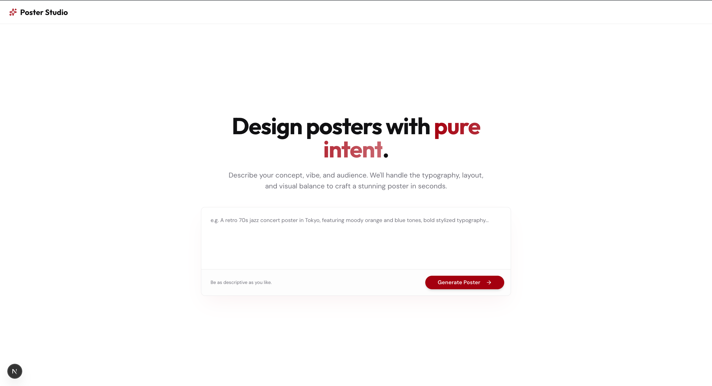

# Poster Generator Flow

## What this kit does and the problem it solves

This kit converts a natural-language poster idea into a generated HTML poster that can be previewed and exported from the web app.

It solves the common problem of fragmented poster creation workflows (copywriting, art direction, and layout implementation happening across separate tools) by handling the process in one flow:

1. Parse intent from the prompt
2. Create a structured design specification
3. Generate poster HTML output

## Prerequisites and required providers

- Node.js `>= 20` and npm
- A Lamatic account and project
- Access to deploy this flow in Lamatic
- A configured text generation model provider in Lamatic for the 3 Instructor nodes (for example: Gemini, OpenAI, or Anthropic compatible models)

### Flow files

- `config.json` — workflow graph
- `inputs.json` — private node inputs/provider settings
- `meta.json` — flow metadata

## Environment variables needed

Set these in the kit root `.env` or `.env.local` file:

```bash
LAMATIC_PROJECT_ENDPOINT=
LAMATIC_FLOW_ID=
LAMATIC_PROJECT_ID=
LAMATIC_PROJECT_API_KEY=
```

### Required

- `LAMATIC_PROJECT_ENDPOINT` — Lamatic GraphQL endpoint URL
- `LAMATIC_PROJECT_ID` — Lamatic project id (`x-project-id` header)
- `LAMATIC_PROJECT_API_KEY` — Lamatic API key (Bearer token)
- `LAMATIC_FLOW_ID` — deployed flow id for this workflow

### Optional / currently unused by app runtime

- `LAMATIC_AGENT_ID` — legacy variable not required by current app runtime and not included in `.env.example`

## Setup and run instructions

1. From `kits/agentic/poster-generator`, install dependencies:

   ```bash
   npm install
   ```

2. Copy env template:

   ```bash
   cp .env.example .env
   ```

3. In Lamatic:
   - Import/open `flows/poster-generator/config.json`
   - Configure private inputs from `flows/poster-generator/inputs.json`
   - Deploy the flow
   - Copy endpoint, project id, API key, and flow id to `.env` / `.env.local`

4. Run the app:

   ```bash
   npm run dev
   ```

5. Open `http://localhost:3000`.

## Usage examples

### Example prompts

- `A retro 70s jazz concert poster in Tokyo, moody orange/blue palette, bold typography.`
- `Minimalist climate awareness poster for subway display, urgent but hopeful tone.`
- `Cyberpunk startup launch poster for social media, neon palette, high contrast.`

### Example API request

```bash
curl -X POST http://localhost:3000/api/generate-poster \
  -H "Content-Type: application/json" \
  -d '{"prompt":"Art deco film festival poster with gold accents and dramatic lighting"}'
```

Expected response:

```json
{
  "is_valid": true,
  "validation_issues": [],
  "html_code": "<!doctype html>...",
  "poster_name": "art-deco-film-festival"
}
```

## Screenshots

### Home screen



### Generated poster sample


